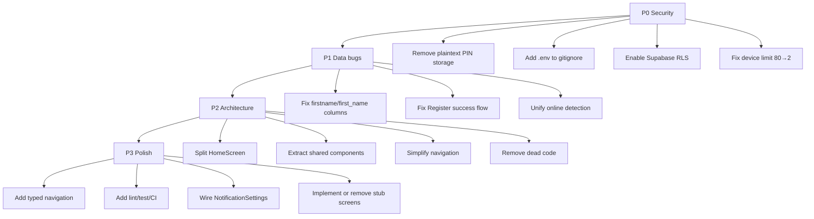

# Codebase Review: SkyIoT Devices App

This is an **Expo React Native** app for agricultural IoT device control (motors, tanks, schedules) backed by **Supabase**. The core motor-control flow with realtime updates and ack/timeouts is solid, but the project has grown organically and shows several architectural, security, and consistency issues worth addressing.

---

## What’s Working Well

**Motor control logic** — `HomeScreen` and `MotorScreen` implement a thoughtful pattern: optimistic state updates, device ack tracking, rollback on timeout, and Supabase realtime subscriptions. That’s the hardest part of IoT apps, and it’s largely in place.

**Device onboarding** — `MotorSelectScreen` validates 6-digit device IDs by prefix (`11` motor, `22` tank, etc.) and routes inserts to the correct tables.

**UI polish in places** — `AnimatedTank` is a nice reusable component. The dark theme with green accent is consistent in intent.

**Infrastructure basics** — Expo 54, EAS build config, push notification setup in `NotificationSettingScreen`, and Supabase session persistence via AsyncStorage are all reasonable foundations.

---

## Critical Issues (Fix First)

### 1. Security vulnerabilities

| Issue | Location | Risk |
|-------|----------|------|
| **PIN stored in plaintext** | `RegisterScreen` inserts `pin` into `users` table | Anyone with DB or RLS bypass can read passwords |
| **WiFi passwords stored client-side** | `DeviceSelectScreen` saves `ssid` + `password` to Supabase | Credentials exposed in DB and over the network |
| **Fake email auth** | `{phone}@gmail.com` in Login/Register | Fragile, confusing, and not a real email channel |
| **Admin API from client** | `supabase.auth.admin.deleteUser()` in Register | Will never work with anon key; gives false sense of rollback |
| **`.env` not gitignored** | `.gitignore` only ignores `.env*.local` | Supabase keys can be committed accidentally |

**Recommendations:**
- Never store PINs in the `users` table — Supabase Auth already holds the password hash.
- Move WiFi provisioning to a secure backend or device-local flow; never persist WiFi passwords in a queryable table.
- Use phone-based OTP auth (Supabase supports this) instead of synthetic Gmail addresses.
- Add `.env` to `.gitignore` immediately and rotate keys if they were ever committed.
- Enforce **Row Level Security (RLS)** on every table (`pump_motor`, `tank`, `user_sessions`, `devices`, `users`).

### 2. Data schema inconsistency (likely bugs in production)

Registration writes `first_name` / `last_name`:

```109:118:screens/RegisterScreen.tsx
      const { error: profileError } = await supabase
        .from("users")
        .insert({
          id: userId,
          first_name: firstName,
          last_name: lastName,
```

But profile display reads `firstname` / `lastname`:

```231:238:screens/HomeScreen.tsx
        const { data: profile } = await supabase
          .from("users")
          .select("firstname, lastname")
          .eq("id", uid)
          .single();

        if (profile?.firstname || profile?.lastname) {
```

User names may never show after registration unless both column sets exist in the DB.

### 3. Registration flow bugs

- Success `Alert.alert("Registration Successful!", )` has **no message body** and doesn’t navigate to Login.
- On `profileError`, the code only throws for duplicate keys — other failures silently fall through to “success”.
- Comments say “4-digit PIN” but validation requires **6 digits**.

### 4. Device limit logic is wrong

```55:61:screens/LoginScreen.tsx
      if (!existingSession && count >= 80) {
        await supabase.auth.signOut();
        Alert.alert(
          "Access Denied",
          "This account is already logged in on two other devices."
        );
```

The threshold is `80` but the message says **two devices**. This looks like a typo (`>= 2` was intended).

---

## Architecture & Code Organization

### `HomeScreen.tsx` is a ~1,300-line god component

It handles: user profile, motors, tanks, realtime subscriptions, polling, sync heartbeat, bottom sheet forms, footer nav, and motor toggling. This makes it hard to test, debug, and extend.

**Suggested split:**

```
hooks/
  useMotors.ts          // fetch, subscribe, toggle, polling
  useTanks.ts           // fetch, subscribe, CRUD
  useUserProfile.ts
components/
  MotorCard.tsx
  TankCard.tsx
  AppFooter.tsx
  AppHeader.tsx
lib/
  datetime.ts           // utcToIST, formatDateTime (duplicated 3× today)
  motorStatus.ts        // isMotorOnline helper
```

### Duplicated UI patterns

Footer navigation, back buttons, and tab bars are copy-pasted across `HomeScreen`, `ProfileScreen`, `AgriControlScreen`, `GardeningScreen`, and `FilterScreen`. Extract one shared `FooterNav` component.

### Dead / unwired code

| File | Status |
|------|--------|
| `components/Card.tsx` | Never imported |
| `components/MotorUsageChart.tsx` | Never imported |
| `screens/NotificationSettingScreen.tsx` | Not registered in `App.tsx` navigation |
| `screens/TankScreen.tsx` | Registered but tank CRUD also lives in `HomeScreen` |
| `screens/DeviceSelectScreen.tsx` | Overlaps with `MotorSelectScreen` / `DashboardScreen` |
| `1NPDPRO5.XLS`, `1NPDPRO5.PDF` | Unrelated files in repo root |

Clean these up or wire them in to reduce confusion.

### Placeholder screens

`AgriControlScreen`, `GardeningScreen`, and `FilterScreen` are stubs (“Welcome to…”). Either implement them or remove from the drawer until ready — users will hit dead-end screens.

---

## Navigation Problems

**Over-complicated structure** — Stack + Drawer with many screens registered twice (`Home`, `Gardening`, `Profile` appear in both drawer and stack).

**Inconsistent navigation patterns:**

- `AgriControlScreen` / `GardeningScreen` use `navigation.reset()`
- `FilterScreen` uses `navigation.popToTop()`
- Others use `navigation.navigate("Home")`

These behave differently depending on stack depth.

**Bug in ProfileScreen:**

```227:227:screens/ProfileScreen.tsx
        <TouchableOpacity onPress={() => navigation.goBack("Home")} style={styles.backButton}>
```

`goBack()` does not accept a route name — this should be `navigation.navigate("Home")` or proper stack typing.

**Missing root providers:**

- No `GestureHandlerRootView` (needed for `@gorhom/bottom-sheet`)
- No `SafeAreaProvider` at app root (mixed use of `SafeAreaView` from RN vs `react-native-safe-area-context`)

---

## Performance Concerns

`HomeScreen` runs **three concurrent data mechanisms** for motors:

1. Realtime subscriptions per motor (`subscribeToMotor`)
2. Polling every **5 seconds** for all motors
3. `sync_duration` heartbeat every **10 seconds**

That’s redundant load on Supabase and the device. Pick one primary strategy (realtime + fallback poll) and remove the rest.

**Channel leak risk** — `fetchData()` calls `subscribeToMotor()` for every motor on each focus, which can recreate channels repeatedly. MotorScreen handles cleanup better; HomeScreen should mirror that pattern.

**Full-screen loading overlay** — Any motor toggle blocks the entire UI. Per-motor loading (already partially there with `toggleLoadingIds`) is enough.

**Online detection inconsistency:**

- `HomeScreen`: `(heart_beat_count ?? 0) > 5`
- `MotorScreen`: `(hb ?? 0) >= 5`

These should share one helper.

---

## TypeScript & Code Quality

`tsconfig.json` has `"strict": true`, but usage of `any` is widespread (`navigation: any`, `session: any`, motor rows as `any[]`). Define:

```typescript
// types/navigation.ts
export type RootStackParamList = {
  Login: undefined;
  Register: undefined;
  Drawer: undefined;
  MotorDetailsScreen: { motorData: PumpMotorRecord };
  // ...
};
```

Also add:
- **ESLint** + **Prettier** for consistent formatting (indentation is inconsistent in several files)
- **Jest** for critical hooks (motor toggle, device ID validation)
- A **README** with setup, env vars, and Supabase schema expectations

---

## UX Improvements

| Area | Suggestion |
|------|------------|
| Login | Remove “Success” alert on every login; navigate automatically via auth state |
| Login | Add loading/disabled state on the button during auth |
| Theme | `app.json` sets `userInterfaceStyle: "light"` but the app is dark — set to `"dark"` |
| Colors | Many hardcoded hex values (`#4ade80`, `#dc2626`) instead of `COLORS` from `theme/index.ts` |
| PIN entry | Restrict Login PIN input to digits only (Register already does this) |
| Errors | Replace `console.log` in production paths with a proper logger or user-facing toasts |

---

## Suggested Priority Roadmap



---

## Summary

The app has a **working IoT control core** (motor realtime + ack pattern, tank visualization, device registration by prefix). The biggest risks are **security** (plaintext PINs, WiFi passwords in DB, weak auth model) and **data bugs** (column name mismatch, broken registration flow, device limit typo).

Architecturally, the main refactor target is **`HomeScreen.tsx`** — splitting it and deduplicating shared UI will make everything else easier. Adding RLS, typed navigation, linting, and a README would bring this from a prototype to something maintainable for a team.

If you want, switch to **Agent mode** and I can help implement any of these — I’d start with the P0 security fixes and the registration/profile column mismatch.
